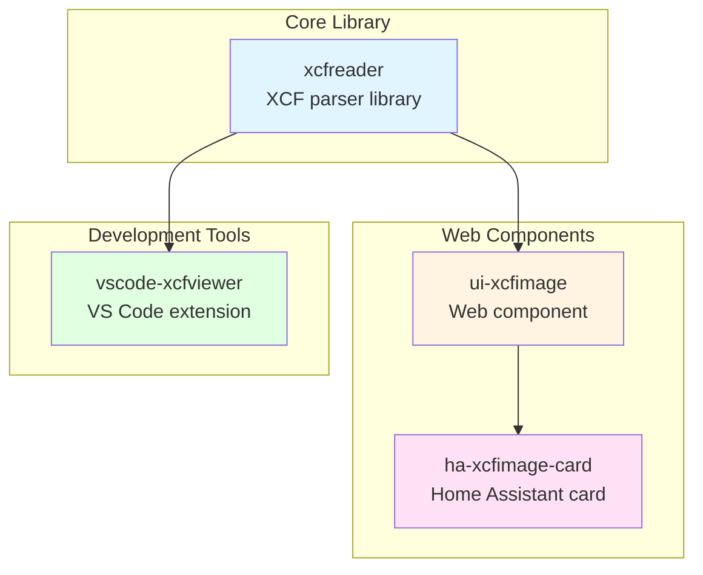
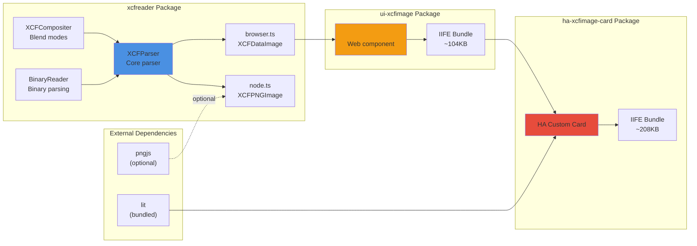
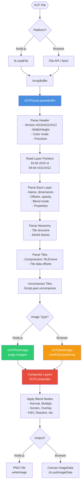
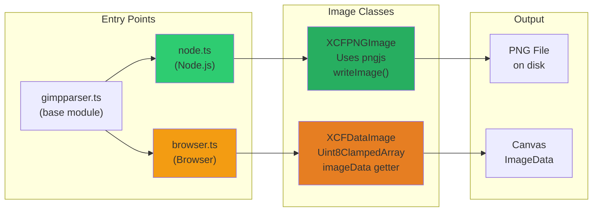
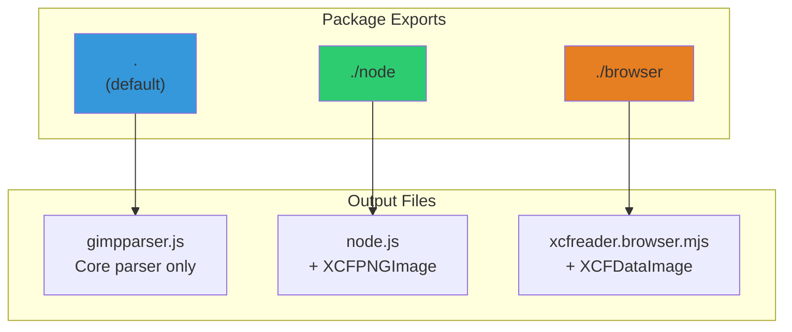
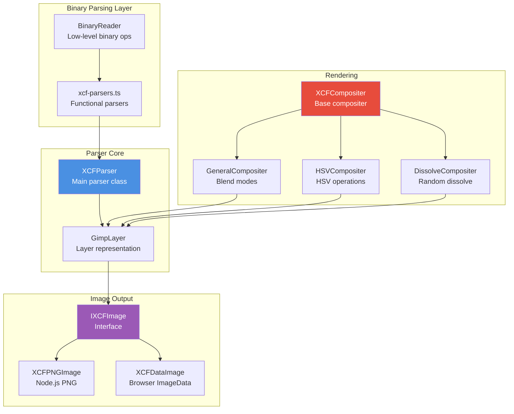
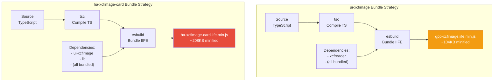
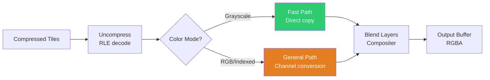
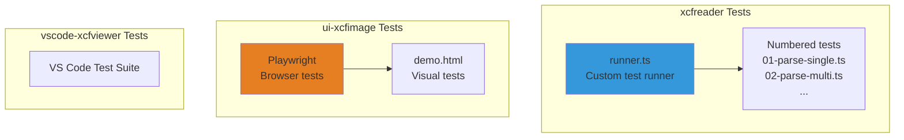
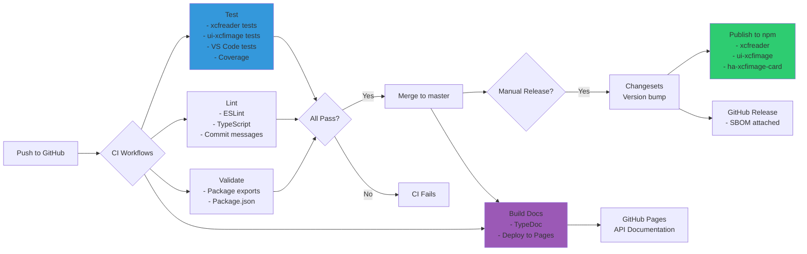

# xcfreader Architecture

This document provides an overview of the xcfreader monorepo architecture, package relationships, and data flow.

## Table of Contents

- [Package Overview](#package-overview)
- [Package Dependency Graph](#package-dependency-graph)
- [XCF Parsing Data Flow](#xcf-parsing-data-flow)
- [Platform Differences](#platform-differences)
- [Module System](#module-system)
- [Key Components](#key-components)
- [Bundle Strategy](#bundle-strategy)

---

## Package Overview

The xcfreader monorepo consists of four packages:



### Package Details

| Package              | Type              | Size       | Runtime Deps       | Description                             |
| -------------------- | ----------------- | ---------- | ------------------ | --------------------------------------- |
| **xcfreader**        | Library           | ~50KB min  | 0 (pngjs optional) | Core XCF parser for Node.js and browser |
| **ui-xcfimage**      | Web Component     | ~104KB min | 0 (self-contained) | `<gpp-xcfimage>` custom element         |
| **ha-xcfimage-card** | HA Card           | ~208KB min | 0 (self-contained) | Home Assistant integration              |
| **vscode-xcfviewer** | VS Code Extension | N/A        | Uses xcfreader     | XCF preview in VS Code                  |

---

## Package Dependency Graph



---

## XCF Parsing Data Flow

The following diagram shows how XCF files are parsed and rendered:



### Parsing Steps Detail

1. **File Loading**: Platform-specific loading (fs in Node.js, File API in browser)
2. **Binary Parsing**: Custom `BinaryReader` reads XCF binary format
3. **Version Detection**: Supports v010 (32-bit), v011/v012 (64-bit)
4. **Header Parsing**: Extracts image metadata (dimensions, color mode, precision)
5. **Layer Parsing**: Reads layer hierarchy with offsets and properties
6. **Tile Processing**: Decompresses 64×64 tile blocks (RLE or uncompressed)
7. **Compositing**: Applies blend modes and layer opacity
8. **Output**: Platform-specific image output (PNG file or ImageData)

---

## Platform Differences

### Node.js vs Browser



### Key Differences

| Feature          | Node.js (`node.ts`)                                        | Browser (`browser.ts`)                                         |
| ---------------- | ---------------------------------------------------------- | -------------------------------------------------------------- |
| **Entry Point**  | `import { XCFParser, XCFPNGImage } from '@xcfreader/node'` | `import { XCFParser, XCFDataImage } from '@xcfreader/browser'` |
| **Image Class**  | `XCFPNGImage`                                              | `XCFDataImage`                                                 |
| **File Loading** | `XCFParser.parseFileAsync(path)`                           | `XCFParser.parseBuffer(arrayBuffer)`                           |
| **Output**       | PNG file via `writeImage()`                                | Canvas ImageData via `.imageData`                              |
| **Dependencies** | Optional `pngjs` for PNG output                            | None (pure JS)                                                 |
| **Buffer Type**  | Node.js `Buffer`                                           | `ArrayBuffer`                                                  |

---

## Module System

### Package Exports

The xcfreader package provides multiple entry points using package.json `exports` field:



### Import Examples

```typescript
// Core parser only (no image classes)
import { XCFParser } from "@theprogrammingiantpanda/xcfreader";

// Node.js with PNG support
import { XCFParser, XCFPNGImage } from "@theprogrammingiantpanda/xcfreader/node";

// Browser with ImageData support
import { XCFParser, XCFDataImage } from "@theprogrammingiantpanda/xcfreader/browser";
```

---

## Key Components

### Core Parser Components



### Component Responsibilities

1. **BinaryReader**: Low-level binary operations (readUint8, readInt32, readFloat64, etc.)
2. **xcf-parsers.ts**: Functional parsers for XCF structures (header, layers, properties)
3. **XCFParser**: Main parser orchestrator, manages parsing workflow
4. **GimpLayer**: Represents a single layer with tile data and rendering
5. **XCFCompositer**: Base class for blend mode implementations
6. **IXCFImage**: Interface for platform-specific image implementations
7. **XCFPNGImage/XCFDataImage**: Platform-specific image output classes

---

## Bundle Strategy

### Self-Contained Bundles

Both web component packages use **IIFE (Immediately Invoked Function Expression)** bundles that include all dependencies:



### Bundle Configuration

Both packages use:

- **esbuild** for bundling
- **bundle: true** - includes all dependencies
- **external: []** - no external dependencies
- **format: 'iife'** - self-executing bundle
- **minify: true** - production builds

This means:

- **Zero runtime dependencies** - users can use with `<script>` tags
- **No build step required** - drop-in usage
- **All deps in devDependencies** - not installed at runtime

---

## Performance Optimizations

### Critical Performance Patterns

1. **DataView Reuse**: Create DataView once per buffer, reuse in loops
   - **Before**: 906ms (creating 16.7M DataView objects)
   - **After**: 305ms (creating ~100 DataView objects)
   - **Improvement**: 66% faster

2. **Grayscale Fast Path**: Specialized rendering for grayscale images
   - Skips RGB conversion overhead
   - Direct channel value copying

3. **Zero-Allocation Compositing**: Bulk operations without intermediate allocations
   - In-place pixel blending
   - Reused composite buffers

4. **Tile-Based Rendering**: 64×64 tile blocks
   - Memory-efficient for large images
   - Cache-friendly access patterns

### Rendering Pipeline



---

## Testing Strategy

### Test Structure



### Coverage

- **xcfreader**: 87.54% coverage (c8)
- **ui-xcfimage**: 95% coverage (Playwright V8)
- **Combined**: 87.85% coverage
- **CI Enforcement**: Minimum 80%, warning at 85%

---

## CI/CD Pipeline



---

## Development Workflow

### Repository Structure

```
xcfreader/
├── packages/
│   ├── xcfreader/          # Core parser library
│   │   ├── src/
│   │   │   ├── gimpparser.ts      # Main parser
│   │   │   ├── node.ts            # Node.js entry
│   │   │   ├── browser.ts         # Browser entry
│   │   │   ├── lib/               # Core libraries
│   │   │   ├── types/             # Type definitions
│   │   │   ├── tests/             # Test suite
│   │   │   └── examples/          # Usage examples
│   │   └── dist/                  # Compiled output
│   │
│   ├── ui-xcfimage/        # Web component
│   │   ├── src/
│   │   │   └── gpp-xcfimage.ts    # Component implementation
│   │   ├── dist/                  # Bundles (ESM + IIFE)
│   │   └── tests/                 # Playwright tests
│   │
│   ├── ha-xcfimage-card/   # Home Assistant card
│   │   ├── src/
│   │   └── dist/                  # IIFE bundle
│   │
│   └── vscode-xcfviewer/   # VS Code extension
│       ├── src/
│       └── dist/
│
├── example-xcf/            # Test XCF files
├── .github/
│   ├── workflows/          # CI/CD pipelines
│   └── CONTRIBUTING.md     # Contributing guide
├── .husky/                 # Git hooks
└── scripts/                # Build/validation scripts
```

### Git Hooks (Husky v9)

- **pre-commit**: Prettier formatting, ESLint
- **commit-msg**: Conventional commits validation
- **pre-push**: Run all tests

### Commit Convention

```
type(scope): subject

[optional body]

Co-Authored-By: Claude Sonnet 4.5 <noreply@anthropic.com>
```

Types: `feat`, `fix`, `docs`, `style`, `refactor`, `perf`, `test`, `build`, `ci`, `chore`, `revert`

---

## Future Architecture Considerations

### Potential Improvements

1. **Streaming Parser**: Process XCF files in chunks for memory efficiency
2. **Web Workers**: Offload parsing to background thread in browsers
3. **WASM Port**: High-performance parsing via WebAssembly
4. **Layer Virtualization**: Render only visible layers for large files
5. **Caching Layer**: Cache parsed layer data for repeated rendering
6. **Progressive Rendering**: Display low-res preview while parsing

### Scalability

Current limitations and future plans:

- **File Size**: Large XCF files (>100MB) may cause memory issues
- **Layer Count**: Performance degrades with 50+ layers
- **Tile Caching**: No tile cache, re-decompresses on each render
- **Parallel Processing**: Single-threaded, could benefit from parallelization

---

## References

- [CONTRIBUTING.md](.github/CONTRIBUTING.md) - Development setup
- [CLAUDE.md](CLAUDE.md) - Project conventions
- [Copilot Instructions](.github/copilot-instructions.md) - Detailed architecture notes
- [TypeDoc Documentation](https://andimclean.github.io/xcfreader/) - API reference
